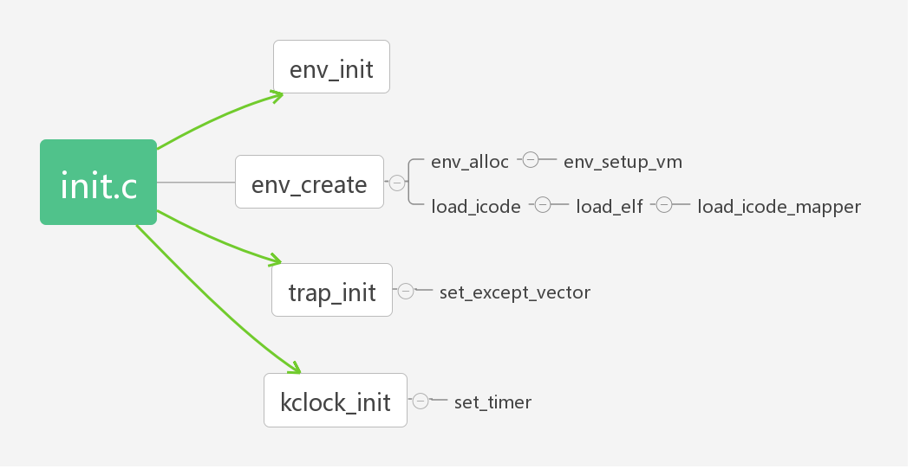
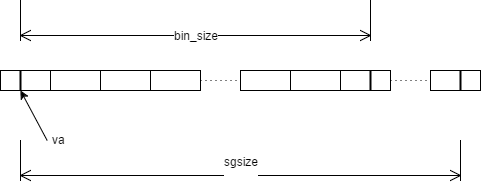

### Lab3实验报告
---
[TOC]
#### 思考题
* Thinking 3.1
  只有使用逆序插入，我们才能保证以从前往后的方式从```env_free_list```中取出PCB块，即第一次调用```env_alloc```能从中取出```envs[0]```。

* Thinking 3.2
  1. 因为```UTOP```之上的所有映射对于任意一个地址空间都是一样的，只有为每个进程都拷贝一份内核才能使用的虚页表，进程才会有成为临时内核的资格，才可以发出申请变成内核态下运行的进程。
  2. ```ULIM```是0x80000000，是操作系统分配给用户地址空间的最大值，```UTOP```是0x7f400000，是用户能够操控的地址空间的最大值。```UTOP```到```ULIM```这段空间用户不能写只能读，也应属于“内核态”，是在映射过程中留出来给用户进程查看其他进程信息的，用户在此处读取不会陷入异常。
  3. ```UVPT```需要自映射到它在进程的```pgdir```中对应的页目录地址。这样当我们需要将```UVPT```这块区域的虚拟地址转换为物理地址时，就能方便地找到对应的页目录。

* Thinking 3.3
  ```user_data```实际上是在```env_create```中用```env_alloc```分配出来的，在```load_icode_mapper```中需要将其强制转换为```env```。没有该参数是不可以的，因为在我写的代码中，它被作为连接```load_icode```, ```load_elf```, ```load_icode_mapper```的纽带，只有一路传递下去了，我们才能在```load_icode_mapper```中用它找到进程对应的页目录，完成```page_insert```的工作。

* Thinking 3.4
  1. 指令位置是针对虚拟空间所定义的。
  2. entry_point对于每个进程是一样的，因为elf文件都被加载到了固定位置，因此每个进程运行代码的入口点是相同的。在网上查阅了ELF文件的格式之后得知，ELF文件并不是一开始就是代码，而是要经历一系列的header和magic数据之后才可到达代码区。所以我认为，这种统一来自于ELF的格式统一。
  3. 我认为这个值是UTEXT+0xb0，即0x4000b0。

* Thinking 3.5
  这个值应该设置为curenv->env_tf.cp0_epc，因为EPC寄存器存放的正是异常发生时，系统正在执行指令的地址，因此要保存的进程上下文中的env_tf.pc应该设置为该值。

* Thinking 3.6
  KERNEL_SP: 0，TIMESTACK: 0x82000000，我认为这里的TIMESTACK实际上是一个在时钟中断后用于从中取出之前存放的进程上下文信息的栈指针，在include/stackframe.h中出现了代码
  ```C
  .macro get_sp
    mfc0    k1, CP0_CAUSE
    andi    k1, 0x107C
    xori    k1, 0x1000
    bnez    k1, 1f                                                                                                                                           
    nop 
    li  sp, 0x82000000
    j   2f  
    nop 
  1:
    bltz    sp, 2f
    nop 
    lw  sp, KERNEL_SP
    nop 
  2:  
    nop
  ```
  这段代码是宏get_sp中的，而get_sp又是宏SAVE_ALL中的，在handle_int函数中又出现了SAVE_ALL宏。通过阅读这一段汇编代码可知，如果CP0_CAUSE寄存器的exception code非0，即当前是中断导致的异常的话，那么获取的sp就是0x82000000，如果exception code非0，那么获取的sp是存储在KERNEL_SP中的值。所以我认为，**TIMESTACK是系统在发生中断异常时保存现场所用的栈顶指针**，联系到本次实验可以认为是在计时器产生中断后，程序保存上下文所用到的栈顶指针，在```env_run```函数中我们可以看到程序做了将TIMESTACK以下的值复制到进程的trapframe中的操作。
  ```C
  void
  env_run(struct Env *e) {
    ...
    if (curenv!=NULL && curenv!=e) {
        curenv->env_tf = *((struct Trapframe *)(TIMESTACK-sizeof(struct Trapframe)));
        curenv->env_tf.pc = curenv->env_tf.cp0_epc;
    } 
    ...
  }
  ```
  这也就是保存进程的上下文至相应进程的结构体中。

  至于说到TIMESTACK和KERNEL_SP的区别，我认为KERNEL_SP是产生非中断异常时所用到的栈指针，TIMESTACK则是发生中断异常时用到的栈指针，因为在本实验中，只有当exception code不是0，即不是中断导致的异常时，保存的上下文才是在KERNEL_SP中。

* Thinking 3.7
  因为在从env[1]之后开始遍历envs的时候，总会遍历多达NENV-2个env，在此期间env[1]还在继续运行，而如果是在env[0]之后遍历就不会出现这种情况，因为我们马上就能找到env[1]，因此我们看到的是输出的2比1多。在只有两个进程的情况，要降低这种不公平，只需要将sched.c里面的NENV换成2，使得两个进程之间能不经过遍历其他env而迅速切换即可。
#### 实验难点图示

​        我认为本次实验的难点在于完成函数load_icode_mapper，而要完成该函数，我们需要明白整个实验的函数调用关系。（仅仅包含关键函数）

​        

​        从上图可以看出，我们的实验整个流程大致为：初始化进程块之后，创建进程块，随后设置相应的中断产生于处理机制，然后gxemul就会根据设定的周期产生中断，中断处理之后根据我们完成的sched.c中的轮转算法就会开始运行新进程。而其中load_icode_mapper最为复杂，从调用关系上来看我们是在进程创建的过程中，将给定的elf文件加载到进程对应的位置，但是这个加载不上简单的一个bcopy就可以了，因为要考虑到一些边角情况。下图是我的二进制文件加载思路：

​                                

​        首先需要注意的是va未必对齐了BY2PG，其次在拷贝的末尾需要注意va+bin_size也未必对齐了BY2PG，最后还需要注意sgsize可能大于bin_size，因此bin_size之后的部分需要填充0。


#### 体会与感想

​        本次的实验加深我对操作系统进程运行和异常处理机制的理解，特别是PCB块，以前从未听说过它的存在，而在本次实验中这一结构体是记录进程信息的关键。本次实验还让我发现了更多在mmu.h的映射图中的细节，比如明白了UTOP和ULIM是什么，二者之间又是什么。在本次实验的难度方面，我感觉最困难的函数就是load_icode_mapper，其次是env_run，而env_run的坑点来说可能比load_icode_mapper更胜一筹，因为我在env_run中将bcopy的参数写反了，导致src和dst的位置交换，往系统不该写的地方写入了东西，因此陷入莫名的TOO LOW的panic中无法自拔，最终在反复折腾了两个小时之后才解决这个BUG。

​        总的来说，本次实验是一个较为困难的工程，需要花费不少时间才能攻克。