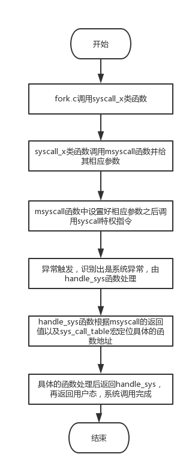
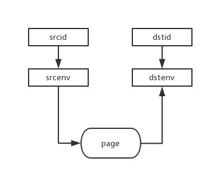

### Lab4实验报告
---
[TOC]
#### 思考题
* Thinking 4.1
  ​	前者说明在fork()之后，子进程的与父进程共享同一段代码。后者说明在fork()中子进程的pc值被设置为父进程调用fork()之后的位置，因此子进程就会只执行fork()之后的代码。

* Thinking 4.2

  ​	答案是C，因为fork()是产生子进程的函数，子进程当然不可能调用它。

  ```c
  sys_env_alloc -> $v0
  $v0 -> envid
  ```

  ​	而根据对fork()返回进程号的理解，fork()实际上调用了函数sys_env_alloc()，如上述代码所示。在子进程中返回值寄存器(v0)被设置为0而且子进程只能执行sys_env_alloc之后的代码，因此子进程得到的envid是0，而在父进程中能执行完整的代码因此得到的envid是子进程id。所以说fork()在两个进程中各自产生了一个返回值。

* Thinking 4.3

  ​	在USTACKTOP以下的页，UTEXT以上的页可以被保护，而在USTACKTOP到UTOP之间的位置不能被保护，即不能被duppage，原因是如果我们将[UXSTACKTOP-BY2PG,UXSTACKTOP]这块区域duppage到子进程，那么父进程与子进程的错误栈就一样了。但是由于两个进程的调度时机不同，子进程应该为其分配一个新的错误栈。所以[UXSTACKTOP-BY2PG,UXSTACKTOP]的区域不应该被保护，而[USTACKTOP,USTACKTOP+BY2PG]的区域是无效内存，因此也不应该被保护。此外，在这个区域中我们对于只读的页不能加上PTE_COW权限，而应该只给可写的页或者原本是PTE_COW权限的页加上PTE_COW权限。因为我们不能将原本不可写的页的权限改成可写。

* Thinking 4.4

  vpd宏是指向用户页目录的指针，即\*vpd=7fdff000=(UVPT+(UVPT>>12)\*4)，vpt宏则是指向用户页表的指针，即\*vpt=7fc00000=UVPT。通过这二者，我们可以得到一个虚拟地址va的页目录项以及其页表项，用法就是(\*vpd)[(VPN(va)>>10)]即得到对应的页目录项，(\*vpt)[VPN(va)]即得到对应的页表项。这两者出现的背景是为了在用户地址空间中实现对内核中相应地址的访问，如果要我在lab2中实现同样的功能，我可以采用UVPT+VPN(va)来代替(*vpt)[VPN(va)]。

#### 实验难点

*    首先我认为理清本次实验的函数调用关系对于理解整个函数的过程是非常有帮助的，我所理解的系统调用关系如下：



​	从中可以看出，本次实验关键的fork函数的调用是以syscall特权指令为基础的，而在异常处理阶段，handle_sys函数依靠sys_call_table宏以及传入的参数所定位到的sys_x类函数正是我们需要完成的一系列基础但重要的函数。

*   在本次实验中我认为比较难的函数之一的是sys_env_alloc函数，在这个函数中，我们需要做的是用env_alloc来创建一个子进程，然后将父进程的运行环境复制给它，再设置其相应的PC值、返回值和状态值。这其中最让人疑惑的是为什么它能在父子进程中返回两个不同的结果，阅读其代码我们可以整理出这样的过程。

    ```C
    ...													syscall_env_alloc()-> $v0
      								$v0  -> newenvid            $v0  -> newenvid
     								    子进程     				父进程
      								/  newenvid=0				newenvid=e->env_id
    e->env_tf.pc = e->env_tf.cp0_epc;
    e->env_tf.regs[2] = 0;
    return e->env_id;

    ...
    ```

    ​	在调用syscall_env_alloc()之后，子进程实际上得以执行的汇编指令是将\$v0的值赋予newenvid的指令，这是因为其pc值被设置为cp0_epc，即发生异常的时候的pc+4，而在接下来又设置了\$v0=0，因此子进程的newenvid得到的就是0，而父进程得以执行完整的代码，因此其\$v0是sys\_env\_alloc的返回值，即e->env_id;

*   此外我认为比较难的函数是sys_mem_map函数，这个函数的难点在于它与之后的pgfault函数有着紧密的联系。下面是sys_mem_map的结构：

    

    ​	显然，此函数是将srcid对应的srcenv的srcva对应的那一页再与dstid对应的dstenv的dstva建立映射关系，这个函数再与sys_mem_unmap函数结合，就构成了pgfault函数的主要部分。

    ​	pgfault函数的作用是处理有COW权限位的页缺失，由于COW的性质，父子进程在修改双方共有的页面的时候不能直接修改，而应该将该页面复制一份，然后才能不破坏另一个享有该页的进程的正常功能。下面对pgfault函数进行分析。

    

    ​	首先，我们需要通过```sys_mem_alloc```来为当前进程的tmp(即UXSTACKTOP-2*BY2PG)处分配上一个刚刚分配出的页，这样这个新的页面就与tmp建立起了映射关系，随后将va处那一页的内容用```user_bcopy```拷贝到tmp处，这实际上完成的就是COW中的Copy操作。再利用我们写好的sys_mem_map将tmp对应的那一页与va建立起映射关系，这样刚刚分配出的那一页与tmp和va都建立起了映射关系，最后调用```sys_mem_unmap```将那一页与tmp的映射关系抹除，这样，只有va与那一页存在映射关系。而我们在整个过程中对这新分配的一页给的权限都是PTE_V|PTE_R，这意味着该页是可写的，因此就满足COW中的Write操作。

#### 感想与体会

​	个人感觉Lab4也许是整个操作系统实验中最为艰难的一个lab，其中各种内核函数的调用关系在最开始不知道的时候感觉分外复杂，而在要完成各种基础sys_x类函数的时候线索的缺失和提示的晦涩也给人带来了不小的麻烦。但是在做完整个Lab4之后又给人一种恍然大悟的感觉，不得不感叹整个机制的精妙与复杂。

​	Lab4最大的考察点是fork，虽然fork函数本身不难填，但是它底层的机制与要思考的问题却挺麻烦。例如，fork机制是依靠底层的sys_env_alloc函数，而sys_env_alloc函数返回两个值的关键在于汇编指令执行的顺序以及相应的PC值的设置，这就与我们之前的计组联系了起来。其次，进程之间的通信也非常有意思，通过对本次实验的理解我发现，不同进程之间的通信就是依靠共有区域，即内核空间来实现的，这样就巧妙地利用了操作系统空间划分的特点。最后，本次实验让我看到了以前不起眼的指令syscall的强大作用，它使得进程陷入内核态，能够完成用户程序所无法完成的任务，这种作用也是我们后面的fork与进程间通信的基础。