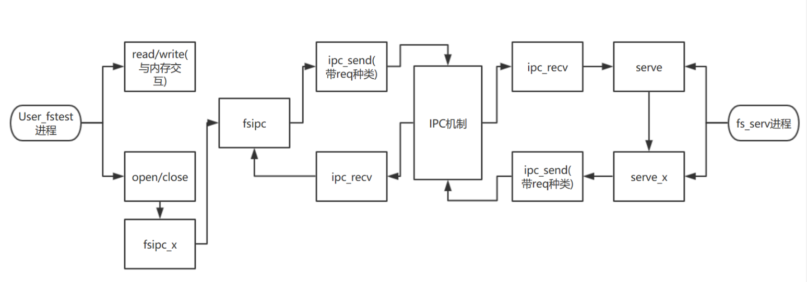

### Lab5实验报告
---
[TOC]
#### 思考题
* Thinking 5.1
  /proc文件系统是LINUX/UNIX系统上的一种内核和内核模块用来向进程 (process) 发送信息的机制。其作用是提供了一种和内核内部数据结构进行交互、获取有关进程的有用信息、在运行中改变设置(通过改变内核参数)的方式。Windows系统通过Win32 API的函数调用来完成与内核模式的交互。这样的设计将对内核信息的访问交互抽象成了对文件的访问修改，简化了交互过程。

* Thinking 5.2
  由于diskaddr函数中的return DISKMAP+blockno*BY2BLK语句返回的是对应磁盘块号的虚拟地址，该虚拟地址必须在[DISKMAP,DISKMAP+DISKMAX]之间，因此磁盘上的块与内存中的块一一对应，支持的最大的磁盘大小就是DISKMAX，即3GB。

* Thinking 5.3
  4KB*1024 = 4MB

* Thinking 5.4
  一个磁盘块有FILE2BLK=16个文件控制块，由于一个目录最多指向1024个磁盘块，每个磁盘块下面最多有16个文件控制块，因此一个目录最多有1024*16=16384个子文件。

* Thinking 5.5
  因为在serve函数中对于每种请求，都调用了相关的serve_x函数，而serve_x函数中会调用ipc_send函数，其中ipc_send函数会调用syscall_yield来切换进程并执行，因此serve中的死循环不会一直在CPU中运行，因此也就不会导致整个内核进入panic状态。

* Thinking 5.6

  因为一个Filefd的结构体的结构如下：                                        

  ```C
  struct Filefd {									
      struct Fd f_fd;									
    	u_int f_fileid;
    	struct File f_file;	
  }											   
  ```

  而一个Fd的结构如下

  ```C
  struct Fd {
  	u_int fd_dev_id;
  	u_int fd_offset;
  	u_int fd_omode;
  }
  ```

  可以看出，Filefd的结构实际上是包含了Fd的结构的，由于在打开一个文件的时候，该文件描述符被分配了一页的空间，然后fsipc\_open在其中设置了文件的各种信息，其中就有f\_fileid以及struct File结构体所能存放的信息，因此一个Fd\*指针指向的那一页中就既存放着struct Fd中应该有的信息，又存放着struct Filefd中应该有的信息，而且由于结构体的内存位置分配原则，struct Fd中的信息在struct Filefd中信息的前面。因此只需要将Fd强制转换为struct Filefd\*类型，就能通过它获取到文件的其他信息。这也正是file.c中很多代码所做的那样。

* Thinking 5.7

  用户进程是将文件内容映射到文件描述符对应的虚地址，然后连续存放文件本身内容，而文件系统进程是将文件内容映射到opentab的一项所对应的一页内存的虚地址处，其中存入的是相应的文件结构体的各种信息。fileid传入的作用是在文件系统服务进程中，部分serve\_x函数可以用open\_lookup函数查找fileid对应的打开的文件，然后进行相应的操作。


#### 实验难点

  我认为本次实验的主要流程如下：



```User_fstest```进程主要依靠```IPC```机制与```fs_serv```进程进行通信来完成对文件系统的操作，除去与内存进行交互的```read/write```函数之外(二者主要依靠```user_bcopy```函数操作数据)，整个lab5最主要的函数我认为就是```open/close```，以及这二者涉及到的```IPC```通信。通过阅读源代码我们可以发现，```open/close```函数中分别都调用了```fsipc_x```类函数(```open```函数中调用了```fsipc_open```函数，而```close```函数中调用了```fsipc_close```函数)，而所有的```fsipc_x```类函数都会调用```fsipc```函数，通过```IPC```机制向```fs_serv```进程发送信息，而```fs_serv```进程中的```serve```函数会根据信息中所包含的请求种类信息调用相应的```serve_x```函数，再通过```IPC```机制向用户进程返回结果信息，从而完成了用户进程所请求的相应的操作。

此外，我感觉到本次本次实验的open函数是本次实验最困难的函数，下面从它的源代码解析。

```C
int
open(const char *path, int mode)
{
        struct Fd *fd;
        struct Filefd *ffd;
        u_int size, fileid;
        int r;
        u_int va;
        u_int i;

        if ((r = fd_alloc(&fd)) < 0) {
                return r;
        }
        if ((r = fsipc_open(path, mode, fd)) < 0) {
                return r;
        }
        va = fd2data(fd);
        ffd = (struct Filefd*)fd;
        size = ffd->f_file.f_size;
        fileid = ffd->f_fileid;
        for (i=0;i<size;i++) {
                if ((r = fsipc_map(fileid, i, va + i)) < 0) {
                        return r;
                }
        }
        return fd2num(fd);
}
```

为了打开一个文件，我们并不是直接就将其内容装入内存，而是要先分配一页，用于盛放文件描述符息，这也是```fd_alloc```函数所做的，随后还需要通过```fsipc_open```向这一页存放相应的文件信息，最后才能通过```fsipc_map```函数完成文件内容与内存的映射。在理解了整个打开文件的机制之后，关闭文件的机制也就容易掌握了。

#### 实验感想

个人感觉本次实验难度尚可，不及lab4的时候带给人的一脸懵逼，而且文件系统与磁盘的交互部分个人感觉也很有意思，是通过向特定位置写值以及从特定位置取出值来达到读写磁盘的目的的。但是本次实验也有一些难点，例如在一开始不理解文件系统服务原来也是一个进程，以为它只是一个机制，所以对ipc在这里出现感到疑惑，但是后来明白我们的用户进程需要通过ipc与文件系统服务进程进行交互，因此fsipc_x函数的作用也就逐渐清晰了。总之，本次实验是一次较为轻松的实验，只需要在少量的地方进行注意即可。