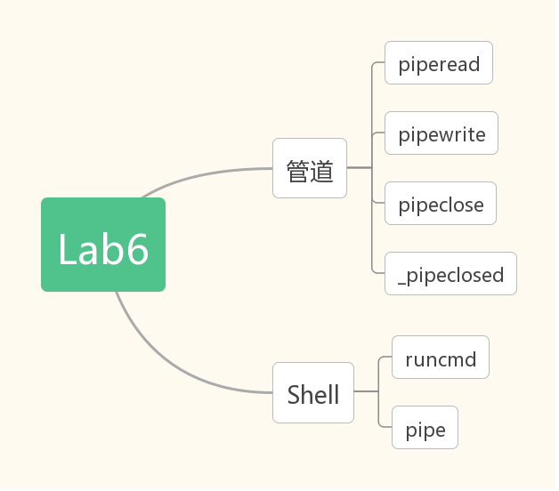

## Lab6实验报告

---

[TOC]

#### 实验思考题

>   Thinking 6.1

&emsp; &emsp; 将```case 0```与```default```的内容交换，并且将其中的```child-process```改成```father-process```即可。

>   Thinking 6.2

&emsp; &emsp; 这是因为```pageref(pipe)``` = ```pageref(fd[0])```+```pageref(fd[1])``` ，因此如果```fd[0]```与```fd[1]```都大于0，则pipe的pageref大于二者之中任意一个，当在dup函数中我们先对fd的pageref++，再对pipe的pageref++的时候，可能存在```pageref(pipe)```=```pageref(fd)```的情况，这里的fd是fd[0]或者fd[1]，如果此时进程被切换到执行_pipeclosed函数，可能造成该函数的误判，导致无法正常完成读写任务。

>   Thinking 6.3

&emsp; &emsp; 系统调用是原子操作，具体代码是在include/stackframe.h中定义的CLI宏，如下所示

```c
.macro CLI
        mfc0    t0, CP0_STATUS
        li      t1, (STATUS_CU0 | 0x1)
        or      t0, t1
        xor     t0, 0x1
        mtc0    t0, CP0_STATUS
.endm
```

&emsp; &emsp; CLI宏在handle_sys函数中出现，作用是设置CP0_STATUS寄存器，因此后面的中断无法发生，因此就无法发生嵌套中断，导致系统调用也不能被打断，因此系统调用是原子操作。

>   Thinking 6.4

1.  可以解决上述竞争问题。这是因为通常pageref(pipe)>pageref(fd)，如果先unmap(fd)，那么pageref(pipe)>pageref(fd)的关系依然保持，所以不会出现二者相等而导致_pipeclosed误判的情况。
2.  与close中的情况类似，dup中依然可能有pageref(pipe)>pageref(fd)的情况出现，如果我们先将pipe的pageref++(用syscall_mem_map)，再将fd的pageref++，那我们依然能够保持pageref(pipe)>pageref(fd)，故不会出现pageref(pipe)=pageref(fd)而导致_pipeclosed误判的情况。

#### 实验难点图示



本次实验主要分为两个大方面：管道与Shell，管道方面需要注意的地方就是管道的读写与竞争，而shell主要注意与管道的结合，以及如何分析输入的命令(runcmd)。

*   pipe

    &emsp;管道的读写都是在一个环形缓冲区中进行，而环形缓冲区大小十分有限，因此读写往往需要父子进程不断切换。那么控制这种切换我们需要借助一些特别的方法，即pageref。通常情况下， 一旦建立起一个管道，两个fd与共享的那个pipe的pageref分别应该是1,1,2。当有一个进程用close函数关闭一个fd时，close实际上做了两个动作，让fd与pipe的pageref都减一，因此两个fd与pipe的pageref变成1,0,1或者0,1,1，我们通过判断某个fd的pageref与pipe的pageref是否相等就可以知道另一个fd是否关闭了。

    &emsp;但是这种pageref判断的方法又引起了竞争的问题，在某些特殊情况下，不同的unmap顺序可能导致恰好出现pageref(fd)与pageref(pipe)相等的情况，这种情况就需要调换unmap或者map的顺序，让pageref(fd)与pageref(pipe)的情况不会错误地出现，以此来避免竞争产生的问题。

*   shell

    &emsp;shell主要的难点在于runcmd，由于runcmd大部分都补全了，只是pipe相关的内容缺失，因此可以说shell的主要难点还是在pipe的形成。但是由于shell处的注释写得非常详细，因此这个pipe部分也很好填写。简而言之，遇到```|```符号则说明我们需要用父子进程的pipe来完成命令。如果是子进程，我们则需要将管道的输出端重定向到子进程的输入端，而将父进程的输出端重定向到管道的输入端。

#### 感想与体会

&emsp;感觉Lab6实际上不是很难，虽然号称管道与shell但是做起来才发现实际上主要还是管道，理解了管道的一些概念之后就会很得心应手，不过由于很久没有做过lab了，因此我lab6也花了相当的一段时间。

&emsp;lab6是本学期操作系统最后一个lab了，一路做下来，感觉每个lab都有自己不甚理解的地方，但是可能由于远程评测点手松，于是莫名其妙地过了。最大的体会是如果这个lab仅仅是过了但是没有解决隐患，那么留到下一个lab的将会是各种debug。

&emsp;整个学习操作系统实验课让我对一个操作系统各种功能的最基本的实现有了一定的了解，或许这在以后能派上用场。